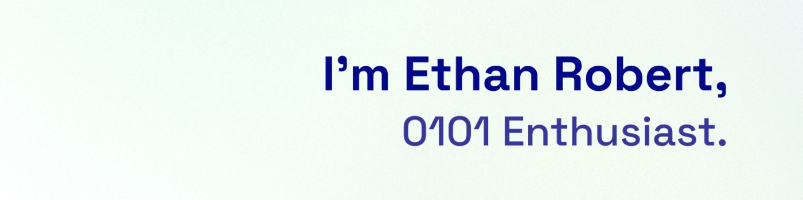

# Hi there 👋 I'm Ethan Robert, a Full-Stack dev!
I've always been interested in computers, tech, and systems. I started learning how to code at age 12. Over the years, I got more and more experience and knowledge about how computers work.
Today, I'm studying Computer Science at the [Universitary Institute of Technology in Lille, FR](https://iut.univ-lille.fr). 

If interested, you can also visit my [former GitHub profile](https://github.com/khyrthy). It contains old projects, like a game I made during my childhood, and old websites!

          
